# El pulido P2 de la revisión UX de julio de 2026

El cajón de pulido de la revisión de la v0.3.0 ([#8](https://github.com/jenarvaezg/coindex/issues/8)),
entero, con la evidencia de antes y después. Todas las capturas son del AVD `coindex-ux`
(pixel_7, android-36) con el mismo inventario de humo —los seis bultos venezolanos, los
paquillos, Koala, Lunar II y Tudor Beasts— y las animaciones desactivadas. Los P0 están en
[`p0-jul-2026.md`](p0-jul-2026.md) y los P1 en [`p1-jul-2026.md`](p1-jul-2026.md).

## 1. El eyebrow decía lo que ya decía la sección

Cada tarjeta del índice llevaba «EVIDENCIA DE COLECCIÓN» —veintitantas veces la misma línea, y
justo debajo del rótulo «Seguidas» o «Disponibles», que es lo que la tarjeta ya era. Ahora el
eyebrow lleva **el emisor**, que es el único dato que la tarjeta no puede deducir de su propio
título.

El nombre no estaba en ninguna columna: `type_meta` guarda el código de Numista, que es
`australie` incluso en un catálogo en español. Sí estaba en `raw`, el cuerpo íntegro de la
respuesta que la caché conserva, así que se lee al vuelo —igual que el `issue.id` de los
paquillos y que el acabado inferido— y **los 608 tipos sembrados desde los assets lo tienen sin
migración y sin gastar una sola llamada**. Dos emisores bajo una misma propuesta, o ninguno,
dejan el eyebrow sin escribir: media tarjeta mal rotulada es peor que ninguna.

## 2. «Por confirmar» no decía qué estaba por confirmar

`0,611 oz · Por confirmar` se leía como un acabado llamado así, o como una variante pendiente de
revisión. En la línea suelta ahora dice **«Acabado sin confirmar»**; en la ficha de
especificación, bajo un rótulo que ya dice ACABADO, basta con **«Sin confirmar»**.

| Antes | Después |
| --- | --- |
| 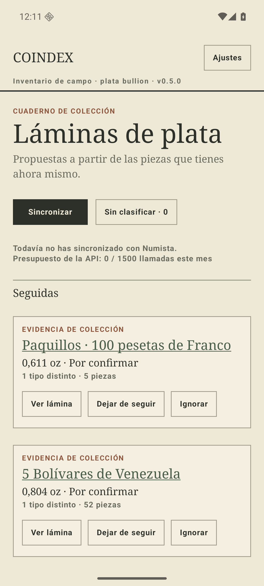 | 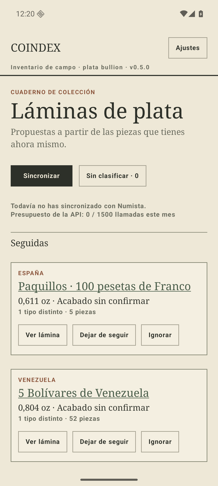 |

## 3. El índice en apaisado: un tercio de pantalla y ninguna tarjeta

`LazyColumn` en apaisado seguía siendo una columna: el masthead, el título y el informe de
sincronización llenaban la pantalla entera y la primera tarjeta empezaba por debajo del pliegue.
Ahora el índice es un `LazyVerticalGrid` cuyas columnas se cuentan desde el ancho de la página
(`indexColumns`, mínimo 340 dp por tarjeta) y, cuando hay más de una, **el encabezado se pliega
en dos**: el título a la izquierda, las acciones y el presupuesto a la derecha. En vertical no
cambia nada: sigue siendo una columna.

| Antes | Después |
| --- | --- |
| 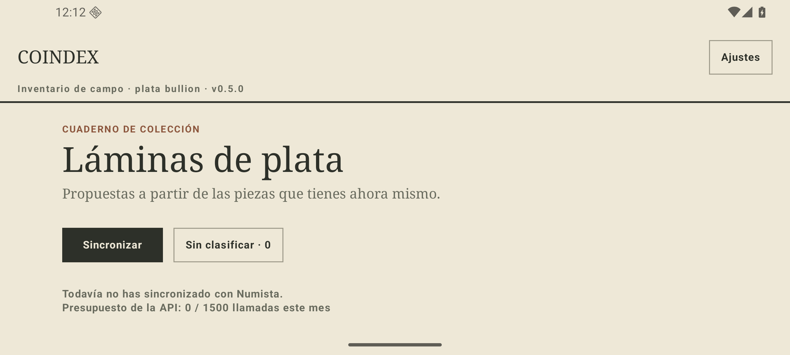 | 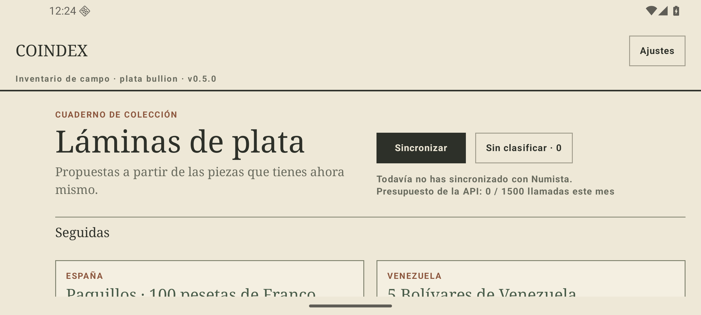 |

## 4. Los date runs se repetían a sí mismos

Cada celda de Venezuela decía «1879» de título y «1879 · Numista 10340» debajo: los mismos dos
datos dos veces, veintiuna veces seguidas. Lo que comparten todos los miembros es del catálogo,
no de la celda: `plateCommonFacts` lo saca a la ficha de la lámina —**TIPO · Numista 10340**— y
`plateCellFootnote` deja en cada celda solo lo que la distingue. En un catálogo de tipos
distintos, donde el año y el N# sí distinguen, la línea sigue exactamente igual que antes.

Un issue run comparte además el año, así que también sube a la ficha (**AÑO · 1966**) y las
cinco estrellas se quedan con su etiqueta.

> **Corregido después (#88).** Subir el tipo solo cuando lo comparten *todas* las casillas lo
> dejaba dentro de la casilla en los 43 catálogos donde no —21 veces el mismo identificador en
> los fuertes, y 121 distintos, sin norma ni excepción, en las personalidades rusas—. El N# ya no
> aparece en ninguna casilla, ni en pantalla ni en la lámina exportada: solo encabeza la lámina
> cuando toda ella es ese tipo. En un catálogo de tipos distintos la línea de la casilla es ahora
> el año a secas.

## 5. `dashed` no dibujaba discontinuo

`FieldCard(dashed = true)` solo cambiaba el color del borde, y su comentario prometía además una
sombra desplazada que la tarjeta nunca dibujó. Ahora es un `PathEffect.dashPathEffect` de
verdad, y significa lo que un recuadro a trazos significa en papel: **aquí no hay nada montado
todavía**. Se queda para las ausencias —la casilla «me falta», el índice vacío, la
sincronización incompleta—; las tarjetas de propuesta, que tienen piezas detrás, pasan al borde
continuo.

## 6. Las fotos, sobre un marco y no sobre un recorte

Las fotos de catálogo están tomadas sobre blanco pero recortadas a distinta altura, así que
sobre el papel crema dejaban rectángulos blancos irregulares que delataban la captura. Cada foto
va ahora sobre un **marco cuadrado del mismo blanco, con la línea fina de la propia tarjeta**.
En la lámina exportada el marco toma el tono del papel, que es exactamente al que `PAPER_TINT`
lleva el blanco de estudio.

| Antes | Después |
| --- | --- |
| 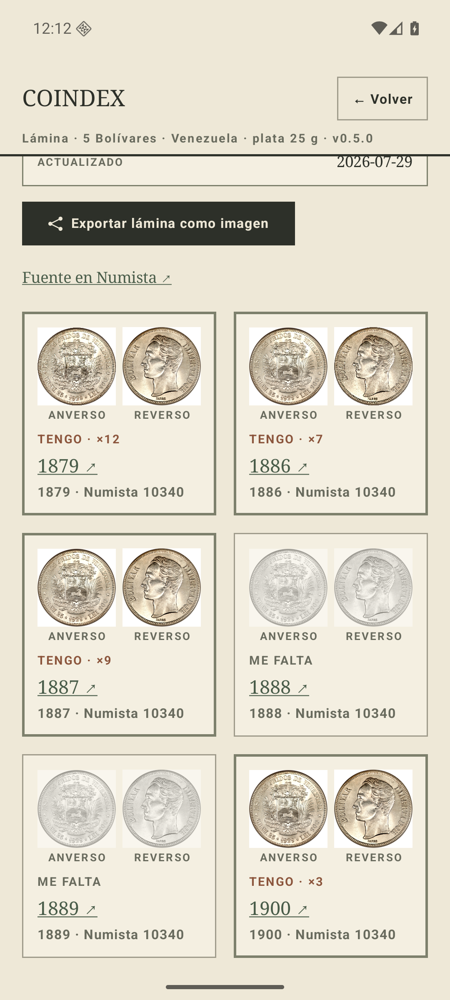 | 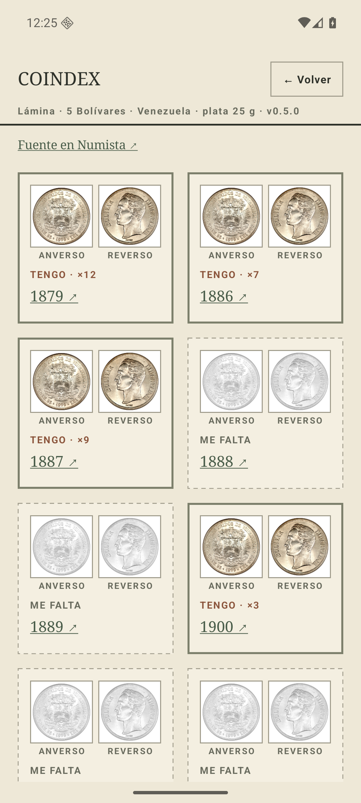 |

La ficha de la lámina recoge lo que las celdas dejaron de repetir:

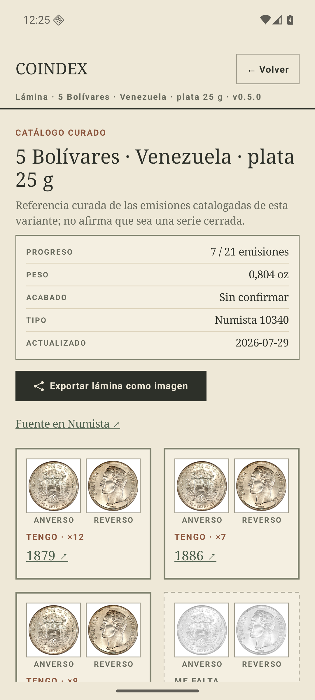

Y la lámina exportada sale igual, con la tira de datos en flujo en lugar de en columnas iguales
—con seis datos, la fecha se partía en dos líneas:

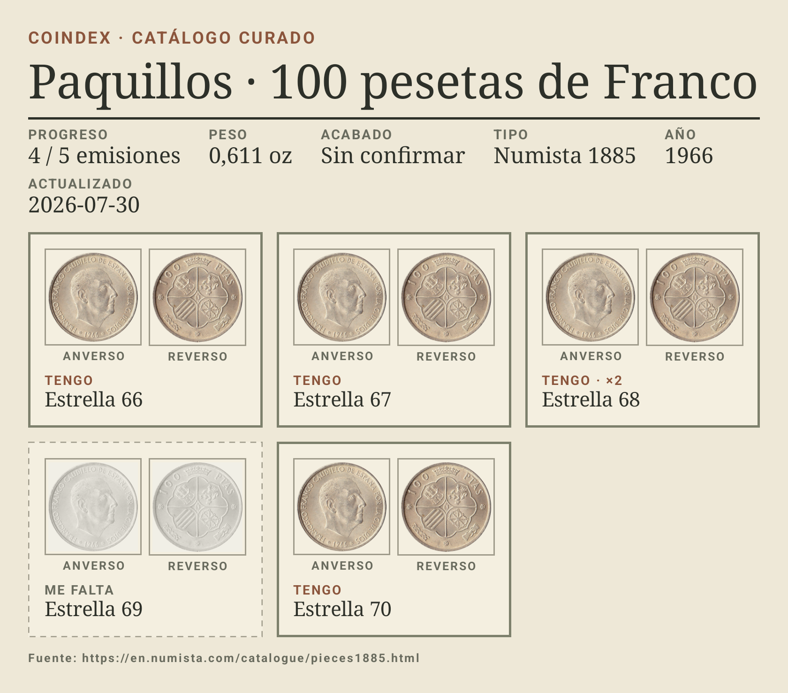

## 7. El plegado de las ignoradas no se veía

«Propuestas ignoradas · 1» no decía si la lista estaba abierta o cerrada: el mismo botón se leía
como «enséñamelas» en los dos estados. Lleva **▸** plegado y **▾** desplegado.

| Plegado | Desplegado |
| --- | --- |
| 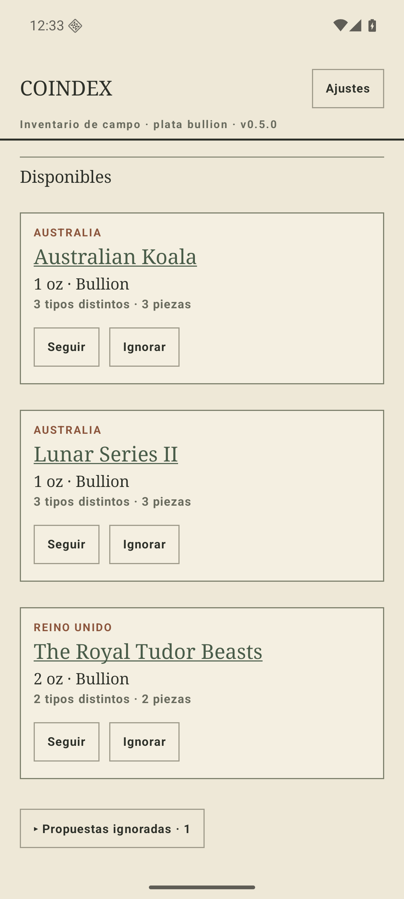 | 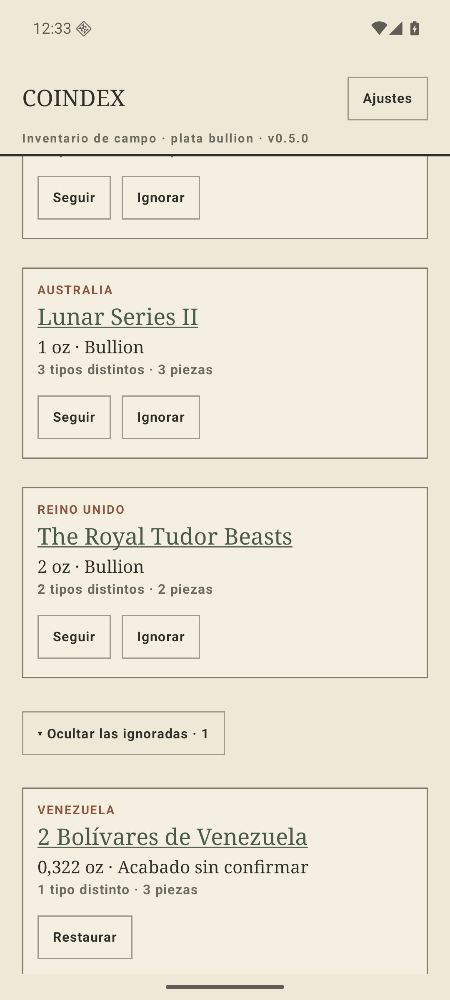 |

## 8. El alta: un botón que no podía funcionar y un teclado encima

«Guardar y empezar» estaba activo con el formulario vacío, y lo único que podía producir era la
queja que el propio formulario ya veía venir: ahora **espera a que haya algo que guardar**. Y la
pantalla lleva `imePadding()`, porque el teclado tapaba el botón y la nota que explica de dónde
salen los dos valores que hay que teclear.

| Antes | Después |
| --- | --- |
| 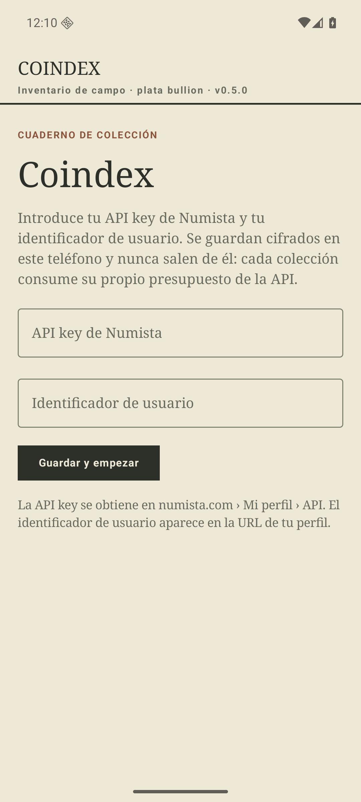 | 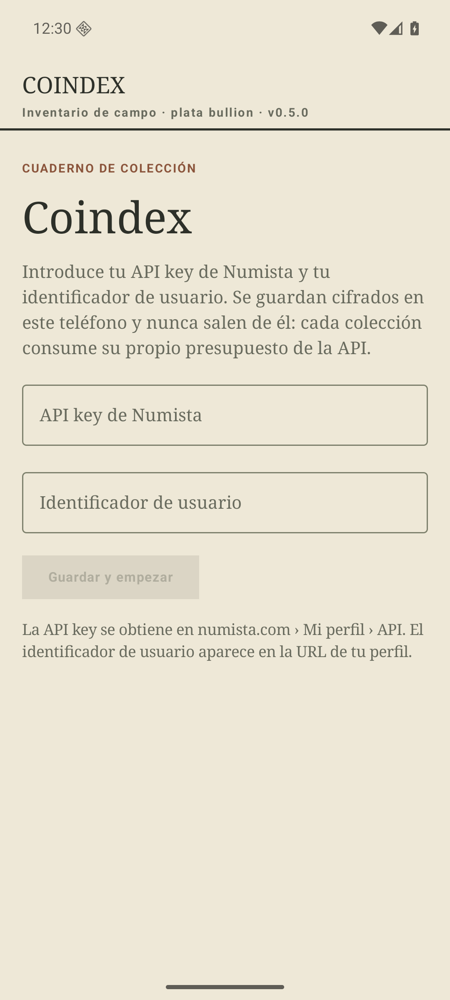 |
| 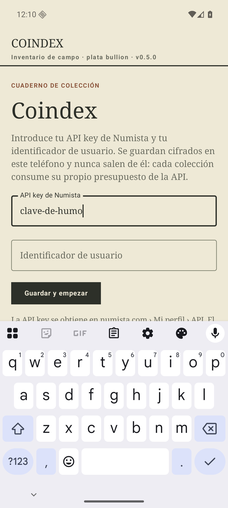 | 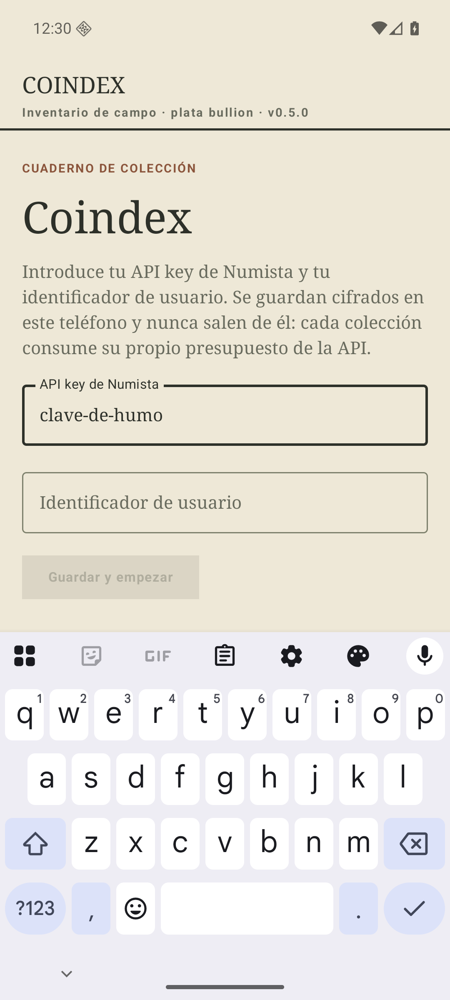 |

## 9. `state.loading` no se usaba

El índice podía parpadear en «Todavía no hay propuestas» mientras leía de la base de datos, que
es mentira sobre una colección que está en el propio teléfono. Mientras carga dice **«Leyendo tu
colección…»**.

## Lo que ya estaba hecho

El último punto del ticket —avisar de que un enlace abre el navegador— lo resolvió la «↗» de
`ExternalLink` en el [P1](p1-jul-2026.md#1-las-acciones-no-parecían-accionables-4). Se comprobó
que todos los enlaces externos que quedan (fuente del catálogo, ficha de Numista de cada celda y
de cada pieza) pasan por ese componente.

## Lo que esto no toca

El [#12](https://github.com/jenarvaezg/coindex/issues/12) sigue abierto: el índice tiene tres
especies de tarjeta parecidas —agrupación tuya, propuesta y catálogo curado— con tres poderes
distintos, y eso es un problema de arquitectura de la información, no de pulido. Los eyebrows de
esta entrega distinguen ya el emisor de la agrupación propia, pero la fusión de especies se
diseña antes de tocar código.
