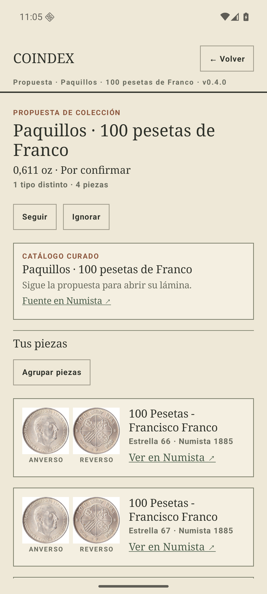
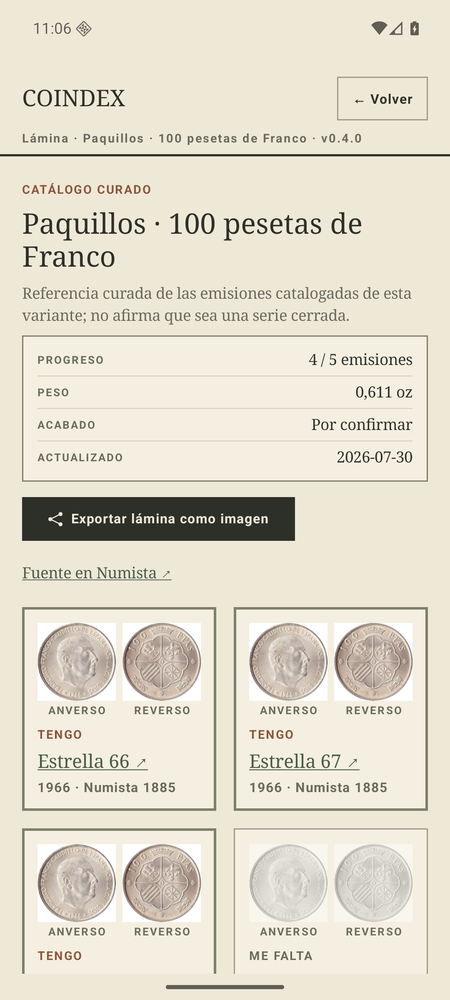
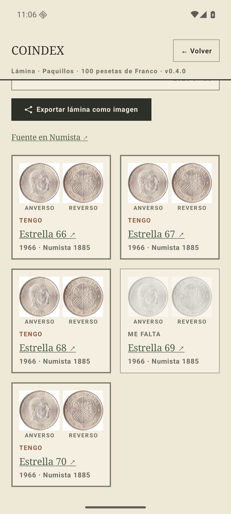
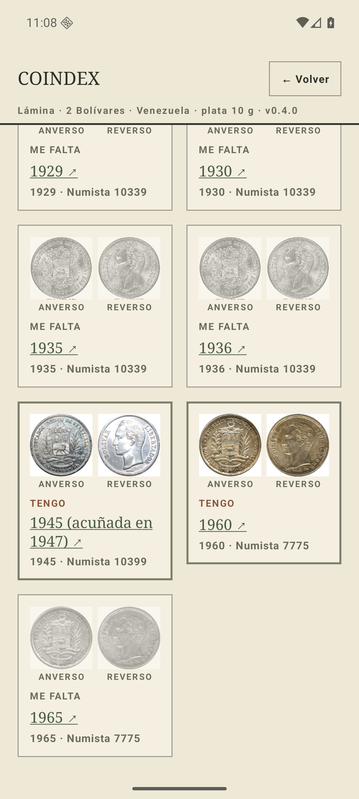

# Los paquillos por emisión, y un «me falta» falso que ya estaba publicado · 30 jul 2026

«En los paquillos, viendo mi colección, falta la de 1969 que no tengo.» La v0.4.0 los sellaba
como agrupación curada, que no declara emisiones y por tanto no puede señalar un hueco. El arreglo
parecía obvio —un date run de las cinco estrellas— y habría sido mentira. Diseño en
[ADR 0014](../adr/0014-issue-run-catalogs.md).

## Lo que dice Numista de verdad

Una llamada a `/types/1885/issues` deja el problema a la vista: **las seis emisiones están
fechadas en 1966** y la estrella es una variedad, no un año.

| Emisión | `year` | `gregorian_year` | Acuñación | `comment` |
| --- | --- | --- | --- | --- |
| 8508 | 1966 | 1966 | 15.045.000 | `"66" on star` |
| 33204 | 1966 | 1967 | 15.000.000 | `"67" on star` |
| 33205 | 1966 | 1968 | 24.000.000 | `"68" on star` |
| 33206 | 1966 | 1969 | — | `"69" on star; curved 9` |
| 368163 | 1966 | 1969 | 4.500 | `"69" on star; straight 9` |
| 33207 | 1966 | 1970 | 995.000 | `"70" on star` |

`recordedYear` es `issueYear ?: gregorianYear`, o sea 1966 en las seis. Un date run de cinco años
habría llenado una casilla y marcado cuatro estrellas como ausentes teniéndolas en el álbum.

Lo que sí distingue las filas es el `issue.id`, y **ya estaba en el teléfono**: `SyncService`
guarda en `CollectedItemEntity.raw` el elemento JSON íntegro de cada fila, así que se lee sin
migración y sin gastar presupuesto. Los `schema_version` 5 identifican sus miembros por emisión y
**ignoran el año**; el 69 lleva sus dos variedades en la misma casilla porque para el coleccionista
es una estrella, y porque el nueve recto —4.500 piezas— como casilla propia sería un hueco eterno.

## El resultado

Las cuatro filas dicen todas 1966 en la base de datos; lo que las nombra es el catálogo.

| La ventana: las filas ya se distinguen | La lámina: 4 de 5 |
| --- | --- |
|  |  |



El inventario de humo se sembró con la **forma real de la API** —`issue.year` 1966 en las cuatro
filas y un `issue.id` distinto en cada una—, que es lo que hace de esto una prueba:

```
sqlite> SELECT id, issueYear, json_extract(raw,'$.issue.id') FROM collected_items WHERE typeId=1885;
2001|1966|8508
2002|1966|33204
2003|1966|33205
2004|1966|33207
```

## El bug que esto destapó, ya publicado en la v0.4.0

El date run de 2 bolívares tomó el año del N#10399 del `min_year`/`max_year` del tipo, que dicen
**1947** porque se acuñó ese año. La emisión trae `year: 1945` con `gregorian_year: 1947`, y la
moneda está fechada 1945, así que `recordedYear` es 1945: **el miembro no podía llenarse nunca** y
la lámina habría dado por ausente una moneda que está en el cajón.

Y lo peor: la lámina se verificó en el AVD sembrando la fila con `issueYear = 1947`, el mismo
supuesto que el catálogo. La prueba le dio la razón al bug en vez de cazarlo. Ahora el miembro se
indexa por 1945 y se etiqueta «1945 (acuñada en 1947)», que dice las dos cosas:



Los 22 años del N#10339 se volvieron a comprobar contra la API uno a uno: estaban bien. El único
miembro equivocado era el que salió del rango del tipo en vez de sus emisiones.

## Reglas que salen de aquí

- Los años de un date run se sacan de `/types/{id}/issues`, no del `min_year`/`max_year` del tipo
  ni de la tabla de la página: ahí se ve `year` frente a `gregorian_year`, y su diferencia es la
  trampa.
- Un date run significa **el año de la moneda** (`year`), nunca el de acuñación.
- Si un catálogo afirma un año o una emisión, las filas sembradas para probarlo tienen que venir
  de la forma de la API, no de lo que el catálogo espera encontrar.
