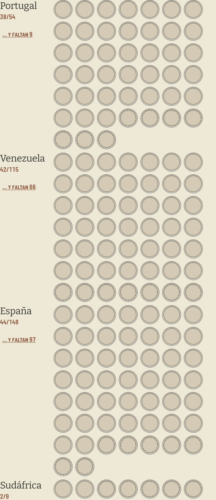
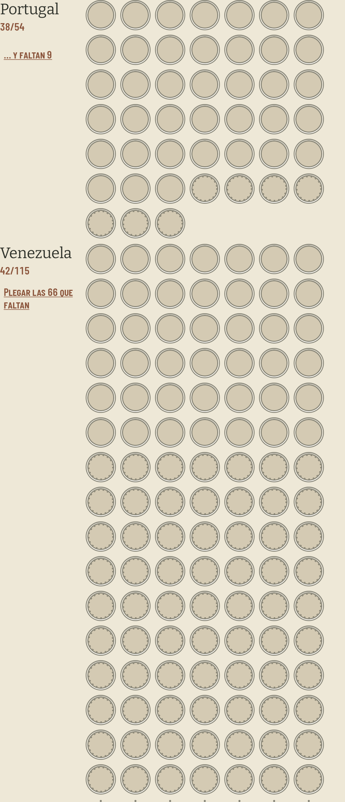

# El pliegue de la mancha: lo que un país tiene, una fila de lo que le falta, y el resto plegado

La respuesta del [#417](https://github.com/jenarvaezg/coindex/issues/417), decidida el 13 de agosto de
2026 sobre una maqueta en HTML a tamaño de móvil real (411 × 914 dp, el Pixel 7 del
[#296](https://github.com/jenarvaezg/coindex/issues/296)) con la mancha del padre reconstruida, y
confirmada en el emulador antes de escribir esto.

El ticket lo planteaba como dilema de dos: colapsar la cola de ausencias de un país, o aceptar que la
mancha duela. La maqueta añadió el listón que faltaba —la app de hoy— y ahí apareció el hallazgo.

## La app no era la mancha que se eligió

| | prototipo del [#315](https://github.com/jenarvaezg/coindex/issues/315) | app v1.2.17 |
| --- | ---: | ---: |
| hueco | ~17 dp, **16 por fila** | `AXIS_HOLE = 34.dp`, **7 por fila** |
| Venezuela 42/115 | 7 filas | **17 filas, 658 dp ≈ una pantalla** |
| la hoja entera (678 casillas) | **2,25 pantallas** | **7,15 pantallas** |

`atlas-315.md` firmó 2,25 pantallas y 390 casillas de una vez cuando se eligió este eje. La
implementación gastó 3,2 × eso, y nadie lo midió: `AXIS_HOLE = 34.dp` nació así en el
[#340](https://github.com/jenarvaezg/coindex/issues/340) (`ba06d15`), sin nota ni medida. Lo único
calibrado a 420 dpi fue el hueco de 5 dp, y para el eje de **años**.

## Las cinco variantes, medidas

Viewport de lista: 635 dp, entre el pliegue y la barra de jerarquías.

| variante | hueco | por fila | hoja | pantallas | casillas en la 1.ª | Venezuela |
| --- | ---: | ---: | ---: | ---: | ---: | ---: |
| 0 · hoy | 34 dp | 7 | 4542 dp | 7,15 | 76 | 17 filas |
| 1 · densidad del atlas | 17 dp | 15 | 1522 dp | 2,40 | 289 | 8 filas |
| 2 · media | 24 dp | 10 | 2567 dp | 4,04 | 139 | 12 filas |
| **3 · cola resumida** | **34 dp** | **7** | **2096 dp** | **3,30** | **78** | **17 filas** |
| 4 · por lámina | 24 dp | 10 | 3788 dp | 5,97 | 64 | 12 filas |

**Elegida la 3**, con las fotos ya descargadas: el hueco no se toca y la hoja baja a la mitad por
resumen y no por tamaño. Encoger el hueco se descarta — a 17 dp la moneda es una lenteja de color, y
el que mira la hoja es el padre.

## Las tres reglas, y lo que cuestan

- **Las monedas del país van juntas y delante.** Para poder resumir ausencias hay que agruparlas al
  final, y con eso el bloque **deja de decir dónde cae una moneda dentro de su serie**. Es la pérdida
  que paga esta decisión: esa lectura vive en la lámina, que la da con el año y el nombre
  ([#473](https://github.com/jenarvaezg/coindex/issues/473)); aquí la pregunta es qué es este país.
- **Una fila de ausencias siempre**, para que la ausencia conserve cara y el coste sea predecible: en
  un móvil, siete huecos por país.
- **El pliegue sólo aparece cuando esconde más que esa fila.** Sudáfrica 2/9 pinta sus siete huecos
  enteros: «… y faltan 2» es más tinta que los dos huecos que ahorraría.

Y una cuarta que salió de la primera captura en el emulador: **la chapa cuelga del cociente**, no del
final de los huecos. Puesta al final de la retícula caía en un renglón propio cada vez que la fila de
muestra salía completa —un renglón en blanco para una marca que tenía casa—, y la columna del nombre
ya es alta de sobra. Ahí además es la continuación de la frase que empieza el cociente: «Venezuela
42/115 … y faltan 66». Los tres bloques de la captura bajaron de 1801 a 1625 px con el cambio.

## Confirmado en el emulador, no sólo en el navegador

`CountryAxisFoldTest` (instrumentado, `coindex-chrome`) fija lo que sólo un dispositivo contesta:

- **387 dp de bloque miden siete huecos por fila** —el número sobre el que se decidió todo—, así que
  Venezuela pliega 66 y no otra cifra.
- La chapa es un objetivo propio de **48 dp** de alto, como la chapa del año de una casilla
  (`minimumInteractiveComponentSize`), y **no abre Monedas**: la fila entera lleva a la lista, la
  chapa abre huecos.
- Desplegada nombra la vuelta, y un país cuyas ausencias caben en una fila no lleva chapa.

El reparto por lámina y el pliegue del modelo se fijan aparte en `CountryAxisFoldTest` de unitarios,
que es donde vive la aritmética.

## Los cabos que deja

- **La hoja entera del padre no se ha medido con esto puesto.** Las 3,30 pantallas son de la maqueta,
  y la maqueta ponía la chapa dentro de la retícula: con la chapa en el rótulo sale algo menos. Para
  medirlo de verdad hace falta su colección en el AVD, y `/private/tmp/coindex-privado` se perdió.
- **El fantasma de un hueco vacío es invisible a 34 dp.** Se pinta al 14 % (`AlbumPaper.kt`), y con
  el interruptor de la maqueta se ve que tener las fotos descargadas no cambia la mancha. Lo que hizo
  legible la fila de muestra fue quedarse en una, no la foto. Aparte: esas fotos son 22 MB que el
  prefetch sólo trae por wifi, así que el padre puede no tenerlas nunca.
- **El país sigue siendo un contenedor sin estructura.** La variante 4 partía Venezuela en sus ocho
  láminas y revelaba lo que hoy no está en ninguna pantalla del eje: **Medios 18/18 y Reales 17/17
  completas**, 1 Bolívar 0/22 y 2 Bolívares 0/25 a cero. Cuesta 5,97 pantallas tal cual, así que no
  entró aquí — pero es un ticket propio y esto lo deja escrito.
- **La reconstrucción de la mancha no es la colección del padre.** Los cocientes visibles en las
  capturas del #340 son exactos y el total cuadra en 170/678; qué casilla concreta tiene es un patrón.
