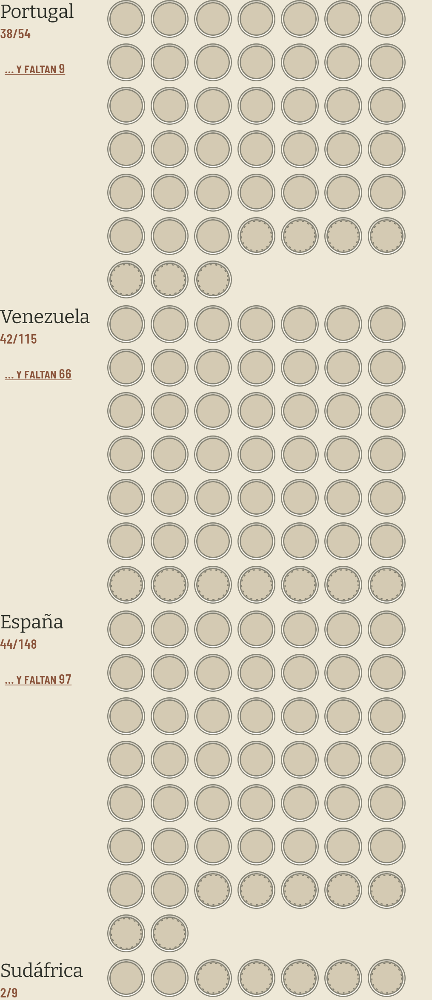
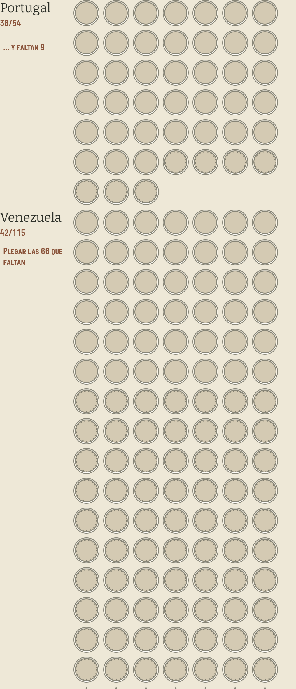

# El pliegue de la mancha: lo que un país tiene, una fila de lo que le falta, y el resto plegado

Respuesta del [#417](https://github.com/jenarvaezg/coindex/issues/417), decidida el 13 de agosto de
2026 sobre una maqueta en HTML a tamaño de móvil real (411 × 914 dp, el Pixel 7 del
[#296](https://github.com/jenarvaezg/coindex/issues/296)) con la mancha del padre reconstruida, y
confirmada después en el emulador.

El ticket planteaba dos salidas: plegar la cola de ausencias de un país o aceptar una mancha larga.
La maqueta se comparó además con la app de entonces, y ahí estaba el problema.

## La app no era la mancha que se eligió

| | prototipo del [#315](https://github.com/jenarvaezg/coindex/issues/315) | app v1.2.17 |
| --- | ---: | ---: |
| hueco | ~17 dp, **16 por fila** | `AXIS_HOLE = 34.dp`, **7 por fila** |
| Venezuela 42/115 | 7 filas | **17 filas, 658 dp ≈ una pantalla** |
| la hoja entera (678 casillas) | **2,25 pantallas** | **7,15 pantallas** |

`atlas-315.md` eligió este eje con 2,25 pantallas y 390 casillas de una vez; la implementación
ocupaba 3,2 veces eso. `AXIS_HOLE = 34.dp` entró en el
[#340](https://github.com/jenarvaezg/coindex/issues/340) (`ba06d15`) sin medirlo; lo único calibrado
a 420 dpi fue el hueco de 5 dp del eje de años.

## Las cinco variantes, medidas

Viewport de lista: 635 dp, entre el pliegue y la barra de jerarquías.

| variante | hueco | por fila | hoja | pantallas | casillas en la 1.ª | Venezuela |
| --- | ---: | ---: | ---: | ---: | ---: | ---: |
| 0 · hoy | 34 dp | 7 | 4542 dp | 7,15 | 76 | 17 filas |
| 1 · densidad del atlas | 17 dp | 15 | 1522 dp | 2,40 | 289 | 8 filas |
| 2 · media | 24 dp | 10 | 2567 dp | 4,04 | 139 | 12 filas |
| **3 · cola resumida** | **34 dp** | **7** | **2096 dp** | **3,30** | **78** | **17 filas** |
| 4 · por lámina | 24 dp | 10 | 3788 dp | 5,97 | 64 | 12 filas |

Se elige la 3, medida con las fotos ya descargadas: el hueco se queda en 34 dp y la hoja baja a la
mitad resumiendo ausencias. Encoger el hueco se descarta: a 17 dp la moneda es una mancha de color,
y quien mira la hoja es el padre.

## Las reglas, y lo que cuestan

- **Las monedas del país van juntas y delante.** Para resumir las ausencias hay que agruparlas al
  final, y con eso el bloque deja de decir dónde cae una moneda dentro de su serie. Esa lectura
  queda en la lámina, con el año y el nombre
  ([#473](https://github.com/jenarvaezg/coindex/issues/473)); el bloque del país responde qué hay de
  ese país.
- **Siempre una fila de ausencias**, para que la ausencia se vea y el coste sea predecible: en un
  móvil, siete huecos por país.
- **El pliegue sólo aparece cuando esconde más que esa fila.** Sudáfrica 2/9 pinta sus siete huecos
  enteros: «… y faltan 2» ocuparía más que los dos huecos que ahorra.
- **La chapa cuelga del cociente**, no del final de los huecos (salió de la primera captura en el
  emulador). Al final de la retícula caía en un renglón propio cada vez que la fila de muestra salía
  completa; junto al cociente continúa su frase: «Venezuela 42/115 … y faltan 66». Los tres bloques
  de la captura bajaron de 1801 a 1625 px.

## Confirmado en el emulador

`CountryAxisFoldTest` (instrumentado, `coindex-chrome`) fija lo que sólo un dispositivo contesta:

- 387 dp de bloque dan siete huecos por fila, el número sobre el que se decidió todo, así que
  Venezuela pliega 66.
- La chapa es un objetivo propio de 48 dp de alto, como la chapa del año de una casilla
  (`minimumInteractiveComponentSize`), y no abre Monedas: la fila entera lleva a la lista y la
  chapa despliega los huecos.
- Desplegada nombra la vuelta, y un país cuyas ausencias caben en una fila no lleva chapa.

El reparto por lámina y el pliegue del modelo se fijan en el `CountryAxisFoldTest` unitario, que
es donde vive la aritmética.

## Los cabos que deja

- **La hoja entera del padre no se ha medido con esto.** Las 3,30 pantallas son de la maqueta, que
  ponía la chapa dentro de la retícula; con la chapa en el rótulo sale algo menos. Medirlo requiere
  su colección en el AVD, y `/private/tmp/coindex-privado` se perdió.
- **El fantasma de un hueco vacío no se ve a 34 dp.** Se pinta al 14 % (`AlbumPaper.kt`), y con el
  interruptor de la maqueta se comprueba que tener las fotos descargadas no cambia la mancha: lo que
  hace legible la fila de muestra es que sea una sola. Además esas fotos son 22 MB que el prefetch
  sólo trae por wifi, así que el padre puede no tenerlas nunca.
- **El país sigue sin estructura interna.** La variante 4 partía Venezuela en sus ocho láminas y
  mostraba lo que hoy ninguna pantalla del eje enseña: Medios 18/18 y Reales 17/17 completas, 1
  Bolívar 0/22 y 2 Bolívares 0/25. Cuesta 5,97 pantallas tal cual; queda para un ticket aparte.
- **La mancha reconstruida no es la colección exacta del padre.** Los cocientes visibles en las
  capturas del #340 son exactos y el total cuadra en 170/678; qué casilla concreta tiene es
  aproximado.
