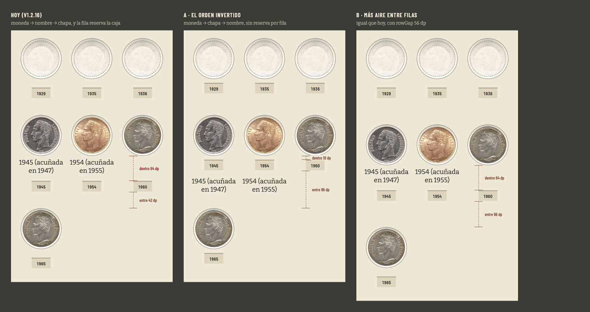
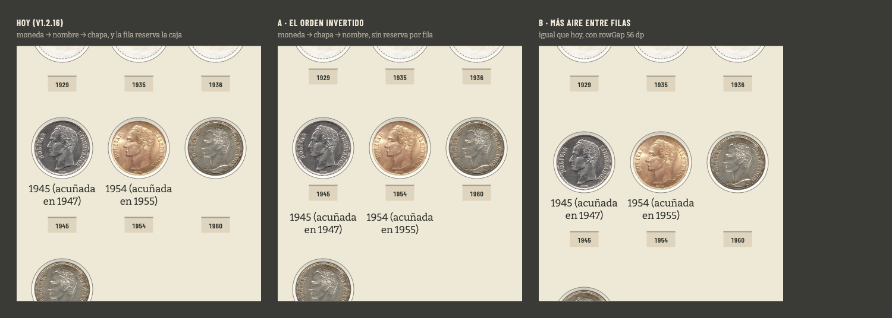
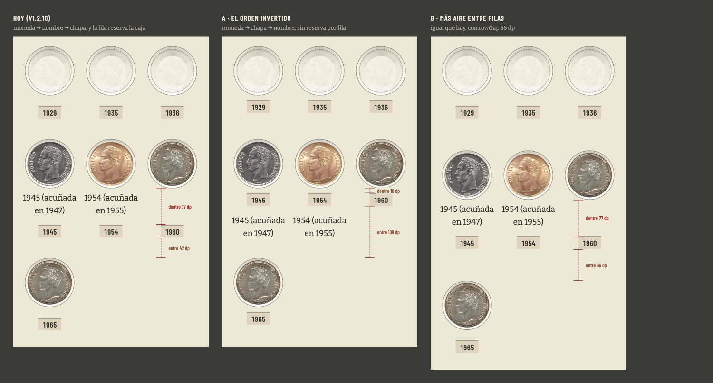

# Prototipo · la casilla sin nombre de una fila con nombre (#473)

Maqueta de forma para el [#473](https://github.com/jenarvaezg/coindex/issues/473). La pregunta que
contesta no es «¿cómo se pinta esto?» sino la que el ticket dejó escrita y sin decidir:

> **Qué habría que decidir.** No es un arreglo mecánico: es elegir qué gana en esa casilla, si la
> línea base compartida del #337 o la proximidad del #411.

Tres pliegues a dp real —la lámina de hoy de listón y las dos salidas— sobre la fila que el ticket
cita: la sexta del **1 Bolívar**, `1945 (acuñada en 1947)` · `1954 (acuñada en 1955)` · `1960`, con
su vecina de arriba y la de abajo. Las cuatro monedas son las del padre y las fotos son las del
catálogo. En HTML y no en Compose porque lo que se elige es **estructura**.

    python3 docs/ux/prototipo-473/build.py && open docs/ux/prototipo-473/maqueta.html

Botonera abajo: las tres a la vez o una sola, **fila cortada arriba** (el escenario del #411),
**letra ×1,3** (la escala de tipo del coleccionista) y **cotas**. También por URL:
`?v=a&corte=1&letra=1&cotas=1`.

## Lo que se maquetó

| | qué propone |
| --- | --- |
| **Hoy** (v1.2.16) | moneda → nombre → chapa. La fila reserva la caja del nombre, y la casilla sin nombre la reserva vacía |
| **A · el orden invertido** | moneda → **chapa** → nombre. La chapa cuelga del hueco y el nombre va debajo; nadie reserva nada por fila |
| **B · más aire entre filas** | igual que hoy con `rowGap` de 32 → 56 dp, y una fila mixta topada en dos líneas |

La B se dibuja en su mejor versión a propósito: sin ese tope compraría la tercera línea que
`plateNameLinesCeiling` le concede al subir el gap, y quien la pagaría es justo la casilla sin nombre.

## Lo medido, sobre el dibujo y no sobre la fórmula

Las dos distancias que el #411 comparó, tomadas de la casilla `1960` —del cartón bajo su moneda a la
tinta de su chapa, y de esa tinta a la moneda de la fila siguiente—:

| | dentro del miembro | entre miembros | |
| --- | ---: | ---: | --- |
| Hoy | **64 dp** | 42 dp | invertida |
| A | 10 dp | 96 dp | |
| B | 64 dp | 66 dp | por 2 dp |
| Hoy · letra ×1,3 | **77 dp** | 42 dp | invertida |
| A · letra ×1,3 | 10 dp | 109 dp | |
| B · letra ×1,3 | **77 dp** | 66 dp | invertida |

## Lo que sólo se vio al dibujarlo

1. **La B no cierra el ticket, lo aplaza.** La caja del nombre se mide contra la densidad y crece con
   la escala de tipo; `rowGap` está en dp y no. A ×1,3 la B vuelve a estar invertida —77 contra 66—
   y ha costado un 10 % de casillas por pantalla en las 75 láminas para arreglar nueve casillas. No
   hay valor de `rowGap` que cierre esto: hay una escala de tipo que se lo come.
2. **En A la línea de chapas hace de regla de la fila.** No es sólo que el blanco se vaya: las tres
   chapas quedan a 10 dp de sus monedas y se leen como una banda pegada a ellas. Se ve mejor con la
   fila cortada arriba, que es el caso que abrió el #411:

   

   En «hoy» y en «B» la chapa `1960` flota sola en mitad del cartón, alineada con `1945` y `1954`
   pero sin nada encima que la reclame. En A cuelga de su moneda aunque la moneda esté cortada.
3. **En A el blanco no desaparece: cambia de lado.** La casilla `1960` sigue siendo más corta que sus
   vecinas, y lo que sobra cae al **fondo** de la casilla, donde se suma a los 32 dp que separan dos
   filas. Ahí el blanco no dice nada falso: entre miembros es donde tiene que estar.
4. **A es invariante bajo la escala de tipo**, y por eso cierra también el primo del ticket: lo que
   separa el nombre de su chapa es `namePadding + slack` = 16 dp, que no crece; y lo que lo separa de
   la fila siguiente es `rowGap`, que tampoco.
5. **A no necesita reservar por fila.** Los nombres arrancan todos a la misma distancia de su chapa,
   así que la fila se sigue leyendo como una banda sin que nadie mida nada: se caen
   `plateRowNameLines`, `plateNameLinesCeiling`, `rememberPlateNameLines` y `plateCellWidth`, que
   existen para sostener una línea base que en A es geometría.

   

## Lo que A cuesta, y no se descubre en la maqueta

- **Cambia la forma de las 75 láminas y del PNG exportado**, que es la misma rejilla. No es un cambio
  de nueve casillas.
- **El orden de lectura cambia**: hoy la casilla se lee «qué es → cuándo», y en A «cuándo → qué es».
  En un date run —la mayoría— no hay nombre y no hay diferencia; donde la hay es en las láminas
  tituladas.
- **La casilla sin año** (un miembro anunciado) no imprime chapa, y su nombre subiría contra el hueco
  si la chapa no reservase su alto igualmente. Es una reserva constante y sin medir, a diferencia de
  la de hoy.
- El cuaderno impreso tiene su propio cartucho (denominación y tema, #350) y **no hereda esto**: es
  el párrafo del papel del #473, que se mira aparte porque `PRINT_CARTOUCHE_MM` está atado al
  recuento de páginas (#350).

## Veredicto

**La A**, decidida por Jose el 12 de agosto de 2026 con la maqueta delante. Implementada en
`docs/ux/implementacion-473/`.

Es la única de las dos que cierra el ticket entero —la casilla sin nombre y la letra ampliada—, y la
única que lo cierra por construcción en vez de por un margen de 2 dp. Es además la salida que el
propio #411 nombró y no tomó: «o el año pegado al hueco, que es su sitio en un álbum físico: la
etiqueta bajo la moneda, y separación franca entre filas».

## Lo que se tira

`build.py`, `maqueta.html` y `fotos/` son del prototipo y se borran cuando el ticket se cierre. Lo
que sobrevive es este README y las tres capturas.
