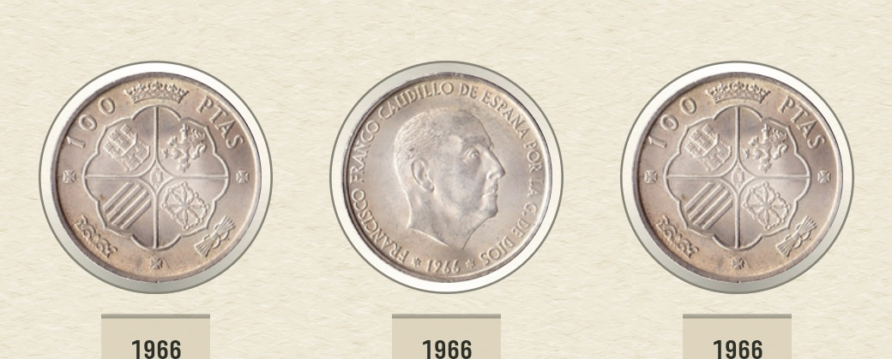
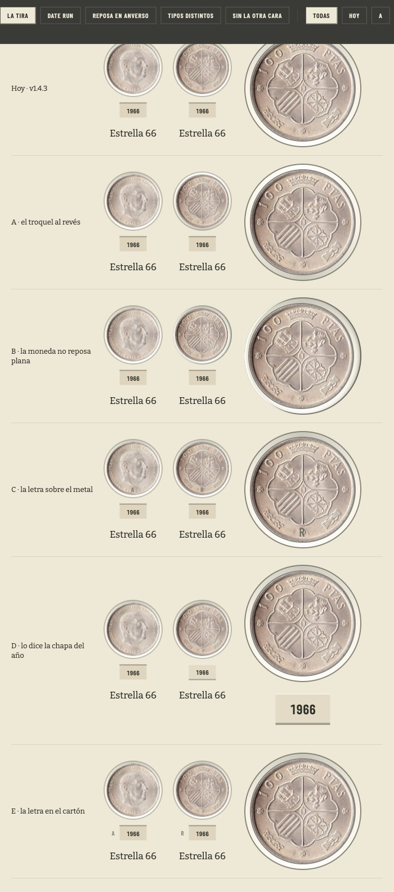
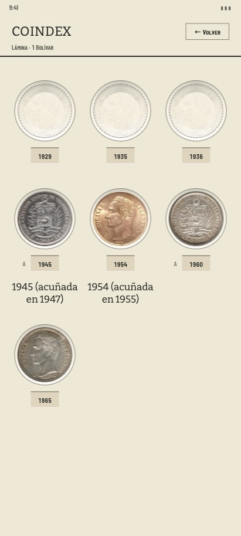
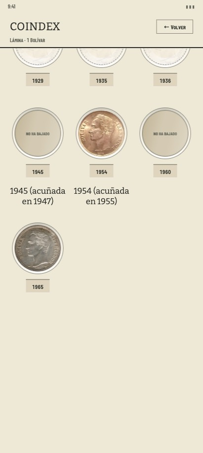

# Prototipo · qué cara mira una casilla volteada (#509)

Maqueta de forma para el [#509](https://github.com/jenarvaezg/coindex/issues/509), que se hace
encima del [#508](https://github.com/jenarvaezg/coindex/issues/508) — ya en `main` — y que bloquea
el [#517](https://github.com/jenarvaezg/coindex/issues/517). Contesta las dos preguntas que el
ticket deja abiertas y que no son la misma:

> - Qué marca declara que una casilla está vuelta, «al estilo de la casa: un canto, una sombra,
>   una letra pequeña».
> - Qué hace una casilla cuando la fotografía de la otra cara no está, en vez de dejar el disco
>   mudo.

Cinco marcas y la de hoy de listón, a dp real, con el giro de verdad — 420 ms, la perspectiva de
`COIN_CAMERA_DISTANCE`, la cara lejana desde su propio cero. En HTML y no en Compose porque lo que
se elige es forma (`prototipar-forma-en-html`).

    python3 docs/ux/prototipo-marca-cara-509/extract.py
    python3 docs/ux/prototipo-marca-cara-509/build.py
    open /private/tmp/coindex-privado/marca-cara-509/maqueta.html

Barra `sticky` arriba: las cuatro escenas, las marcas una a una, el interruptor de **cuándo** se
pone la letra y un «voltear tres». También por URL: `?s=datarun&v=carton&w=vuelta`. **Se toca un
hueco y gira**, que es la única manera de juzgar esto.

## Lo elegido

**La A+ sola — el troquel al revés, con luz — y el hueco sin la foto voltea y lo dice.** Elegido por
Jose el 15 de agosto de 2026 con la maqueta delante: «la que más me gusta es la A, el resto no me
gustan demasiado; la D también está OK». Se descarta sumarle la D: el aro habla solo.

Y con ello el segundo eje se resuelve por construcción: la A **no puede** estar puesta en reposo,
porque en reposo es el dibujo de hoy. La lámina en reposo queda idéntica, la marca es la excepción,
y lo que el título del issue pedía —saber *qué cara* miras— se queda fuera a sabiendas: lo que la
casilla declara es que está vuelta.

### Lo que sólo se supo en el emulador

**De la inversión se ve la mitad, y es la sombra.** Sobre el AVD, la misma fila con dos casillas
vueltas y una en reposo:

| arco del aro | vuelta | reposo | vuelta − reposo |
| --- | ---: | ---: | ---: |
| **abajo** | **172,2** | **185,2** | **−13,0** |
| arriba | 226,4 | 225,4 | +1,0 |

Las dos casillas vueltas dan **el mismo 172,2**, así que los 13 niveles son el dibujo y no el ruido
de dos fotografías distintas. Arriba no pasa nada, y no es un fallo del valor: subiendo
`turnedShadowAlpha` a 1 la parte de abajo cae 59 niveles y **la de arriba sigue moviéndose cero**.
Es el techo que `sheenAlpha` ya tenía escrito desde el #357 — el cartón está a 243 de 255 y al
blanco le quedan 12 niveles de recorrido. De modo que lo que una casilla vuelta dice, dicho con
precisión, es que **la sombra del corte ha cambiado de lado**.

Eso es también la respuesta al «de un vistazo» del ticket: la marca es discreta —que es lo que el
ticket pedía— y se lee **contra la casilla de al lado**, que en una lámina siempre está ahí.

## Las cinco marcas

| | tesis | qué pasa al dibujarla |
| --- | --- | --- |
| **Hoy** · v1.4.3 | el giro no declara nada | listón |
| **A · el troquel al revés** | la pared del corte invierte su luz: la casilla está del otro lado | **se pierde a 104 dp**. Al doble se distingue; en la rejilla, no. Y toca el cartón, que el #302 dejó quieto a propósito |
| **B · la moneda no reposa plana** | vuelta, queda recostada contra la pared del troquel y asoma su canto | legible, y es el único lenguaje puramente metálico. La primera vuelta la escorzó a 172° y **lo que se leía era «más pequeña», no «de canto»**: el escorzo se cambió por un desplazamiento de 1,5 dp |
| **C · la letra sobre el metal** | «A» o «R» al pie del disco, como el punzón de una ceca | se lee, y **rompe una regla escrita**: `AlbumPaper.kt:222` dice que sobre la fotografía ya no se pinta nada — la sombra del troquel se fue en el #357 y el reflejo del acetato en el #338 |
| **D · lo dice la chapa del año** | el rebaje de la chapa se invierte mientras la casilla está vuelta | se pierde a 104 dp, como la A. Y la chapa acaba de cambiar de oficio en el #508: ahora abre la ficha, y hacerla hablar de otra cosa la carga dos veces |
| **E · la letra en el cartón** | la misma letra que la C, pero en la hoja: al lado de la chapa hay 32 dp de cartón libre | **se lee a 104 dp y no toca la fotografía**. Es la C sin su objeción |

## El eje que no estaba en el ticket: cuándo se pone la letra

Al dibujar la E sobre la lámina entera aparece una decisión que el ticket no plantea, y que es más
grande que elegir entre A y E: **si la marca está siempre o sólo cuando se ha volteado**.

Con la letra siempre puesta, una lámina de 22 casillas lleva **22 letras en reposo** — que es
exactamente la prosa que el #300 podó y que el #302 usó para descartar su variante C. Con la letra
sólo en la vuelta, la hoja en reposo queda **idéntica a la de hoy** y la marca es la excepción.

Lo que se pierde: en reposo no se dice qué cara se está mirando. Los tres criterios de aceptación
del ticket se cumplen igual —lo que piden es distinguir *volteada* de *no volteada*—, pero el
título del issue dice «no dice qué cara miras», y eso sólo lo contesta la letra permanente.

## Lo medido, sobre el dibujo

**Ninguna de las cinco cuesta un dp.** La celda mide 113 × 179 dp en las seis columnas, vuelta o en
reposo — la letra de la E va dentro de los 48 dp de área de toque de la chapa, que ya estaban
pagados. Es la diferencia con el #302, donde la chapa costó 7 dp por casilla:

| | celda en reposo | celda vuelta |
| --- | ---: | ---: |
| Hoy, A, B, C, D, E | 113 × 179 dp | 113 × 179 dp |

Y sobre los catálogos de hoy:

| | |
| --- | ---: |
| catálogos | 75 |
| que declaran `printed_side: obverse` | 6 |
| casillas | 1.172 |
| tipos distintos en ellas | 848 |
| **tipos con las dos caras en la caché** | **848 · el 100 %** |

## Lo que sólo se vio al dibujarlo

1. **La fotografía que falta no falta nunca.** Los 848 tipos de los 75 catálogos traen las dos
   caras: no hay una sola casilla en la colección cuya otra cara no exista. Así que el disco mudo
   del 14 de agosto **no es una foto ausente, es una foto que no ha bajado** — el ADR 0024
   precarga sólo en wifi. La regla que ya existe en el código (`AlbumFaces.kt:23-27` retira la
   segunda cara sin foto para que un hueco «nunca ofrezca un giro que aterrice en una silueta»)
   protege a Monedas y a las piezas, **y en una lámina no se dispara jamás**: `printedFaces` no
   descarta nada por diseño (`AlbumFaces.kt:37-38`), y de todos modos no habría nada que
   descartar. Arreglar esto es distinguir «no hay foto» de «aún no ha bajado», que es un estado
   que hoy la casilla no conoce.
2. **En un date run la casilla vuelta ya se ve distinta — y eso no ayuda.** Veintidós casillas de
   la misma moneda: la vuelta enseña otra fotografía y salta a la vista. Lo que no se puede saber
   es **cuál de las dos es la de reposo**, que es justo lo que el ticket dice. En una lámina de
   tipos distintos pasa lo contrario y es peor: como cada casilla es otra moneda, una vuelta no
   desentona con nada.
3. **La marca discreta y la marca legible son la misma decisión que el tamaño.** Las dos variantes
   que no ponen tinta —el troquel de la A y la chapa de la D— se leen al doble y a tamaño real hay
   que buscarlas. *Corregido con la medida delante*: la primera vuelta de este README dijo que se
   perdían, y era un juicio sobre una captura. Aislando la marca —la misma fotografía en las dos
   caras, para que lo único que cambie sea el aro— la A mueve el **38 %** de los píxeles del aro
   con un Δ medio de 9,0, contra el **5,8 %** y Δ 1,1 que ese mismo aro mueve hoy. No es
   invisible: es que **compite con el disco**, que ya cambia el 51 % por el propio giro.
4. **La C está prohibida por el código y no por el gusto.** `AlbumPaper.kt:222` no es un comentario
   suelto: es el resumen de dos tickets que quitaron cosas de encima de la moneda. Una letra sobre
   el metal las reabre.
5. **La D llega tarde por un día.** El #508 acaba de convertir la chapa del año en el segundo
   objetivo de la casilla. Que además cambie de forma al voltear el hueco la hace decir dos cosas
   con una sola pieza.

## Lo que la maqueta no prueba

- **De las seis, sólo la elegida se ha visto en un teléfono** (`medir-en-el-movil-no-en-el-asset`):
  el navegador eligió y el emulador confirmó la A, con lo medido más arriba. La B, la C, la D y la
  E siguen siendo dibujos de navegador, así que sus números de aquí valen para comparar entre ellas
  y no para prometer cómo se leen a 420 dpi.
- **Y lo que el emulador enseñó no estaba en la maqueta**: en HTML las dos mitades de la inversión
  se ven, y en el teléfono la de arriba no existe. Un navegador sobre un fondo `#EEE8D7` tiene
  recorrido para subir el blanco; el papel de la app, a 243 de 255, no.
- **El giro del navegador no es el de Compose.** La perspectiva se traduce del `cameraDistance` por
  el mismo cociente, pero la curva de la animación y el filtrado de la textura no son los mismos.
- **Las tres respuestas al hueco sin foto son dos movimientos y un rótulo**, y dos de las tres no
  se pueden juzgar en una captura: hay que tocarlas en la maqueta.

## Las tres respuestas al hueco cuya otra cara no ha bajado

| | qué hace | la objeción |
| --- | --- | --- |
| **1 · no voltea** | la casilla no toma el toque | el dedo no recibe nada y no se dice por qué: es la casilla muerta del #508 otra vez |
| **2 · el tirón** | arranca 14° y vuelve | responde al dedo sin mentir, y **no dice qué ha pasado** |
| **3 · voltea y lo dice** | gira entero y la silueta lleva escrito que no ha bajado | es la única que informa, y mete cuatro palabras dentro de un hueco |

## Lo privado y lo que se tira

Aquí no hay dinero, así que `dinero-fuera-del-repo-publico` no aplica y el método vive en el repo.
Lo que **no** se versiona es la maqueta: son 2 MB con 68 fotografías de Numista en base64, y el
§8.4 de su licencia no permite redistribuirlas (`contrato-api-numista`). Vive en
`/private/tmp/coindex-privado/marca-cara-509/` y se reconstruye con los dos comandos de arriba.

`extract.py` y `build.py` son del prototipo y se borran cuando el ticket se cierre. Lo que sobrevive
es este README.

## Lo que quedó implementado

- `DieCutWall.turnedStops()` y sus dos alphas, con lo medido en el AVD escrito al lado del valor.
- `AlbumPaper` cruza los dos perfiles sobre el propio progreso del giro, así que la pared llega
  exactamente cuando llega la cara y **nada del cartón se mueve** (ADR 0026 §3).
- `FaceNotDownloaded`, la única copia que cae dentro de un hueco, y se la gana por ser la
  alternativa al disco mudo.

## Lo que queda abierto

- **La casilla sigue sin conocer el estado «la tengo, pero su otra cara no ha bajado».** El aviso lo
  deduce de que la carga se dé por vencida, que es lo que hay: sin red, Coil falla en cuanto no hay
  socket que abrir, y con red lenta la fotografía acaba llegando y el aviso no aparece. Lo que no
  cubre es la red lenta de verdad — unos segundos de disco vacío antes de decir nada.
- **El #517 viste este reparto de gestos**, y ahora tiene una pieza más de la que tirar: si un modo
  puede cambiar el aire de la rejilla entera, la pared del troquel ya sabe hablar.
