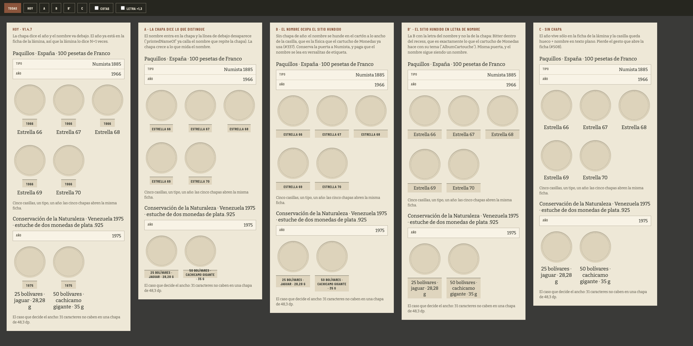
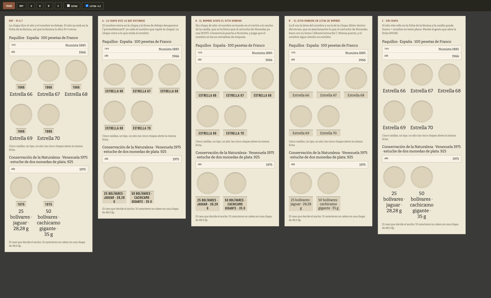

# Prototipo · la casilla cuyo año no discrimina (#511, fleco 4b)

Maqueta de forma para el cuarto roce del [#511](https://github.com/jenarvaezg/coindex/issues/511):

> una lámina de un solo año (Paquillos) repite cinco placas «1966» idénticas mientras lo distintivo
> (Estrella 66…70) va debajo en texto plano.

La decisión no es tipográfica y por eso se dibuja: **la chapa es el gesto que abre la ficha dentro de
la app** ([#508](https://github.com/jenarvaezg/coindex/issues/508)), y es afordancia hecha forma —
*«el año se puede pulsar porque parece una pieza aparte prensada en la hoja»*
([#302](https://github.com/jenarvaezg/coindex/issues/302), `RecessedYearTag`). Cambiar lo que dice
cambia lo que es.

    python3 docs/ux/prototipo-placa-511/build.py && open docs/ux/prototipo-placa-511/maqueta.html

Botonera arriba: las cinco a la vez o una sola, **cotas** y **letra ×1,3** (la escala de tipo del
coleccionista). También por URL: `?v=b2&cotas=1&letra=1`.

## A quién afecta

**Cuatro láminas de las setenta y cinco** tienen el año repetido en todas sus casillas —medido sobre
`data/collection-catalogs/`—, y sus etiquetas van de 11 a 31 caracteres:

| lámina | casillas | lo que distingue |
| --- | ---: | --- |
| `espana-paquillos` | 5 | `Estrella 66` … `Estrella 70` |
| `portugal-1983-exposicion-europea-de-arte` | 3 | `750 escudos · 12,5 g` |
| `italia-2003-europa-dei-popoli` | 2 | `5 euros · 18 g` |
| `venezuela-1975-conservacion-plata` | 2 | `25 bolívares · jaguar · 28,28 g` |

Se maquetan las dos de los extremos: la de la etiqueta más corta y la de la más larga, que es la que
decide.

## Lo que se maquetó

| | qué propone |
| --- | --- |
| **Hoy** (v1.4.7) | chapa con el año, nombre debajo. El año ya está en la ficha de la lámina, así que la lámina lo dice N+1 veces |
| **A · la chapa dice lo que distingue** | el nombre entra en la chapa y la línea de debajo desaparece |
| **B · el nombre ocupa el sitio hundido** | sin chapa: el nombre se hunde en el cartón a lo ancho de la casilla, la física del cartucho de Monedas (#337) |
| **B′ · el sitio hundido en letra de nombre** | la B con Bitter dentro del recess, que es lo que `AlbumCartouche` ya hace con su tema |
| **C · sin chapa** | el año vive sólo en la ficha de la lámina y la casilla queda hueco + nombre plano |

## Lo medido, sobre el dibujo y no sobre la fórmula

Alto de una casilla, en dp, a 411 dp de pantalla y 3 columnas de 113 dp:

| | Paquillos (`Estrella 66`) | Conservación (`25 bolívares · jaguar · 28,28 g`) |
| --- | ---: | ---: |
| Hoy | 169 | 211 |
| A | 142 | **142 — y el texto se sale de la chapa** |
| B | 142 | 170,5 |
| **B′** | **146** | **184** |
| C | 135 | 177 |

## Lo que sólo se vio al dibujarlo

1. **A no cabe, y no lo dice: lo desborda.** `RecessedYearTag` fija `height(28.dp)`, así que la chapa
   no crece con el texto — se queda en 142 dp y las letras se salen por abajo. Con la letra a ×1,3 es
   descarado. No es una cuestión de gusto: 31 caracteres no entran en 48,3 dp y la caja no cede.

   

2. **A y B pagan un peaje que no habían declarado: el nombre pasa a versalitas.** La chapa es Barlow
   Condensed 12 sp con `smcp` — la letra de las **etiquetas** del sistema, la del año y la de los
   chips. «ESTRELLA 66» dentro de ella deja de leerse como el nombre de una casilla y pasa a leerse
   como un dato más. B′ es exactamente la B con esto corregido, y el precedente no hay que inventarlo:
   `AlbumCartouche` ya mete Bitter dentro del mismo recess para el tema de una tarjeta de Monedas.

3. **Todas ahorran alto, incluso la que crece de ancho.** Quitar la chapa redundante devuelve entre 23
   y 27 dp por casilla: la lámina de Paquillos entera pasa de 370 a 324 dp de rejilla.

4. **C es la más limpia y la única que pierde algo.** Sin chapa no queda pieza hundida que pulsar, y la
   ficha de esas cuatro láminas se quedaría sin puerta desde la casilla. El hueco podría tomar el
   toque, pero entonces nada en la hoja anuncia que se puede pulsar, que es justo lo que el #302
   rechazó.

## Lo elegido: B

Vista la maqueta, **B**. Conserva la pieza hundida —y con ella el gesto y su afordancia—, cabe en las
cuatro láminas porque crece con su texto, y le devuelve a la lámina entre 23 y 27 dp por casilla.

La B y la B′ sólo se diferencian en la letra de dentro, y gana la de la chapa: **es la misma pieza que
el coleccionista pulsa en las otras setenta y una láminas**, así que vestirla de Bitter en cuatro de
ellas habría hecho dos objetos de uno. La regla escrita es una sola:

> Cuando el año no distingue a una casilla de sus hermanas, la pieza hundida no lleva el año: lleva
> lo que sí la distingue. El año, que ya está en la ficha de la lámina, no se dice N+1 veces.

Implementado en `CellPlaque` / `plaqueOf` (`PlateSubject.kt`) y `RecessedNameTag`, y medido otra vez en
el AVD: las cinco chapas «1966» de Paquillos son ahora «ESTRELLA 66 … 70», y la ficha se sigue abriendo
desde ellas.
